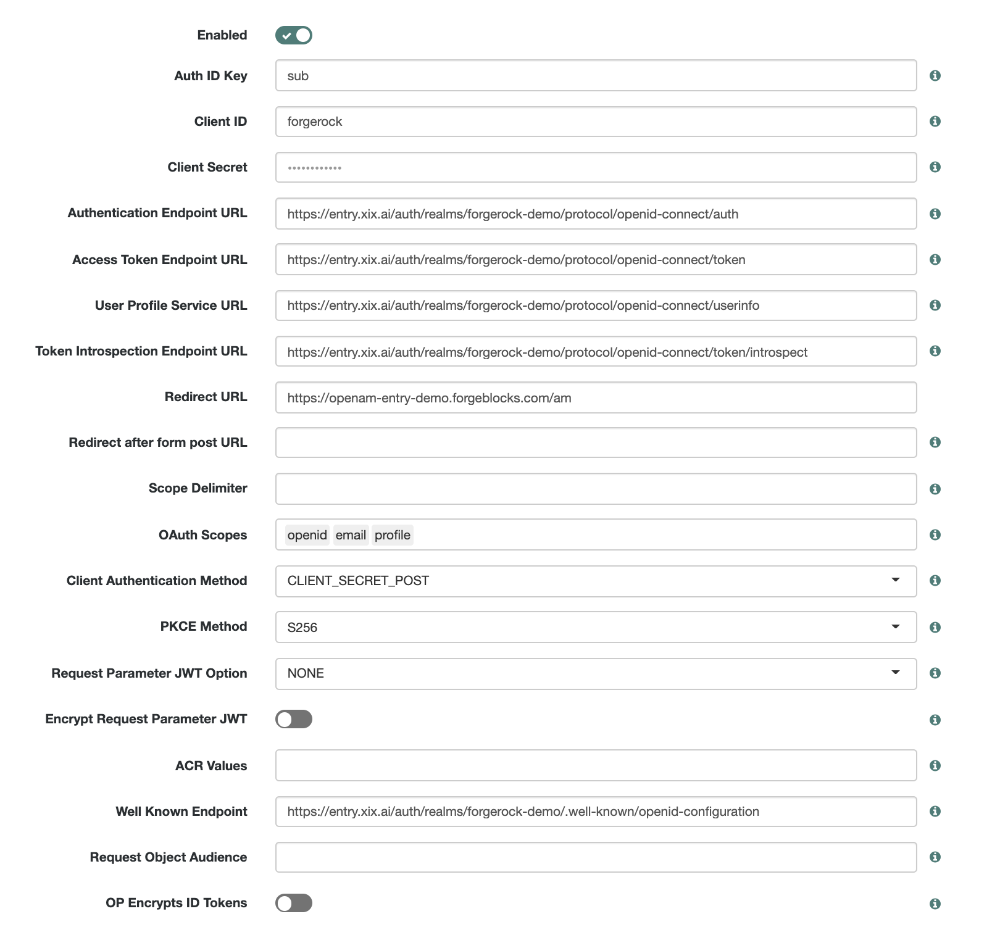
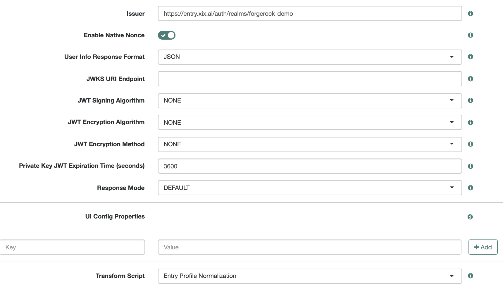
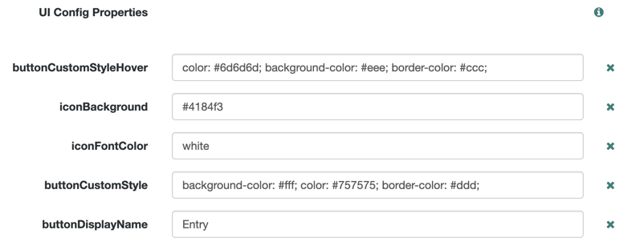
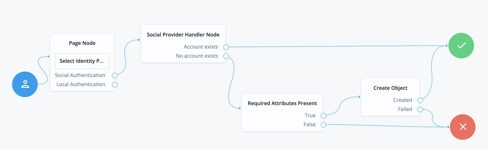
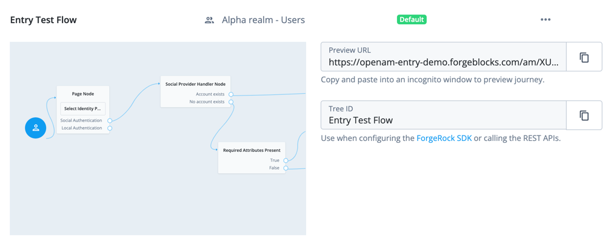

# Entry

# Prerequisites

To get started with this guide you need an existing Entry account with admin access to a Workspace that will allow you to create a client.

If you already an Entry customer, this guide assumes that your Workspace with ID `forgerock-demo` has a client titled `forgerock`. These settings will be very important in the next steps.

# Configure biometric login with Entry

## Create normalization script

1. Open **Access Management** in Native Consoles, select **Scripts** and click **New Script**.
2. Choose a name for the script, e.g. "Entry Profile Normalization".
3. Set Script Type to **Social Identity Provider Profile Transformation**.
4. Paste the following code snippet into the **Script** field:

```java
import static org.forgerock.json.JsonValue.field
import static org.forgerock.json.JsonValue.json
import static org.forgerock.json.JsonValue.object

return json(object(
        field("id", rawProfile.sid),
        field("displayName", rawProfile.preferred_username),
        field("givenName", rawProfile.given_name),
        field("familyName", rawProfile.family_name),
        field("email", rawProfile.email),
        field("username", rawProfile.preferred_username)))
```

4. Click **Save Changes**.

## Social Identity Provider

To define your Workspace defined inside Entry as a trusted IdP, you need to configure a Social Identity Provider inside ForgeRock. Let's go through this configuration step by step:

1. Open **Access Management** in Native Consoles, select **Services**, and choose **Social Identity Providers**.
2. Under **Secondary Configurations** tab, click **Add a Secondary Configuration** and choose **Client configuration for providers that implement the OpenIDConnect specification**.
3. Put `sub` as **Auth ID Key**.
4. Put `forgerock` as **Client ID** - or the correct name of the client you have created in your realm.
5. Open your Entry Admin Dashboard for your Workspace and copy OIDC URL settings to the corresponding fields in ForgeRocks (from Authentication Endpoint URL to Token Introspection Endpoint URL). Do the same for **Well Known Endpoint**.
6. Put the required **Redirect URL** that the user will be redirected after the successful login.
7. Put a single space (" ") as a **Scope Delimeter**.
8. Add `openid`, `email`, `profile` to **OAuth Scopes** - make sure that these items are not space- or -comma separated, but added as separate items.
9. If your Workspace name is `forgerock-demo`, put `https://entry.xix.ai/auth/realms/forgerock-demo` as **Issuer** - or insert your own Workspace name there.
10. For **Transform Script** select the script you have created in the previous step.
11. Click **Save Changes**.
12. Go to Entry Admin Dashboard for your Workspace, open corresponding client (`forgerock` in this guide), and copy its Client Secret to **Client Secret** field. 
13. Click **Save Changes**.

After completing this step, your configuration should look approximately like this:




### Update UI config

We will need this step for adding a "Log in with Entry" button at the beginning of the authentication flow, which will make for a smoother user experience.

These settings will not affect the flow, but make for a good default config:



## Authentication Tree

Now, it's time to create a Journey that will define the authentication flow.

This is the Journey configuration for the Auth Tree:



Next we will look at each node's settings.

### Page Node

**Page Node** should contain a single inner item - **Select Identity Provider** node.

**Select Identity Provider** should contain the following attributes:
- `password` for **Password Attribute**
- `mail` for **Identity Attribute**
- Check **Include local authentication**

### Social Provider Handler Node

- Select `Normalized Profile to Managed User` for **Transformation Script**
- `userName` for **Username Attribute**.
- `BROWSER` for **Client Type**.

### Required Attributes Present

Set `managed/alpha_user` for **Identity Resource** if the name of the realm inside ForgeRock is `alpha`. Otherwise, edit this to match your realm name and corresponding identity resources in use.

### Create Object

**Identity Resource** should have a value that matches the one from **Required Attributes Present** node.


## Final steps

### Testing

For testing this flow, paste the **Preview URL** into an address string in an incognito window. If you have an Entry account, you will be redirected back after you have logged in.

All users in your Workspace should be able to log in to your ForgeRock instance.



### Launching

When everything is thoroughly tested, just set the Journey with the Entry Authentication Tree as default.

# Disclaimer

All implied conditions, representations and warranties, including any implied warranty of merchantability, fitness for a particular cause, non-infringement and title with regard to any XIX product or service, including but not limited to Entry, are disclaimed. In no event does XIX warrant that the product or service is error free, will operate properly or at all in all computer environments and configurations, or that you will be able to operate the product or service without problems or interruptions. XIX does not warrant that the product or service or any equipment, system or network on which the product or service is used will be free of vulnerability to intrusion or attack.
